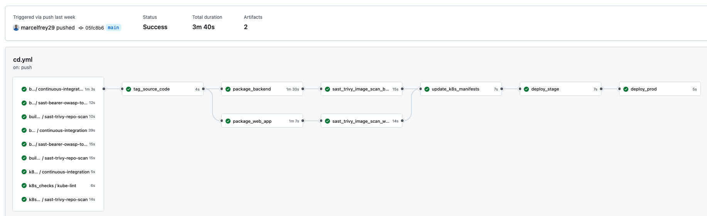
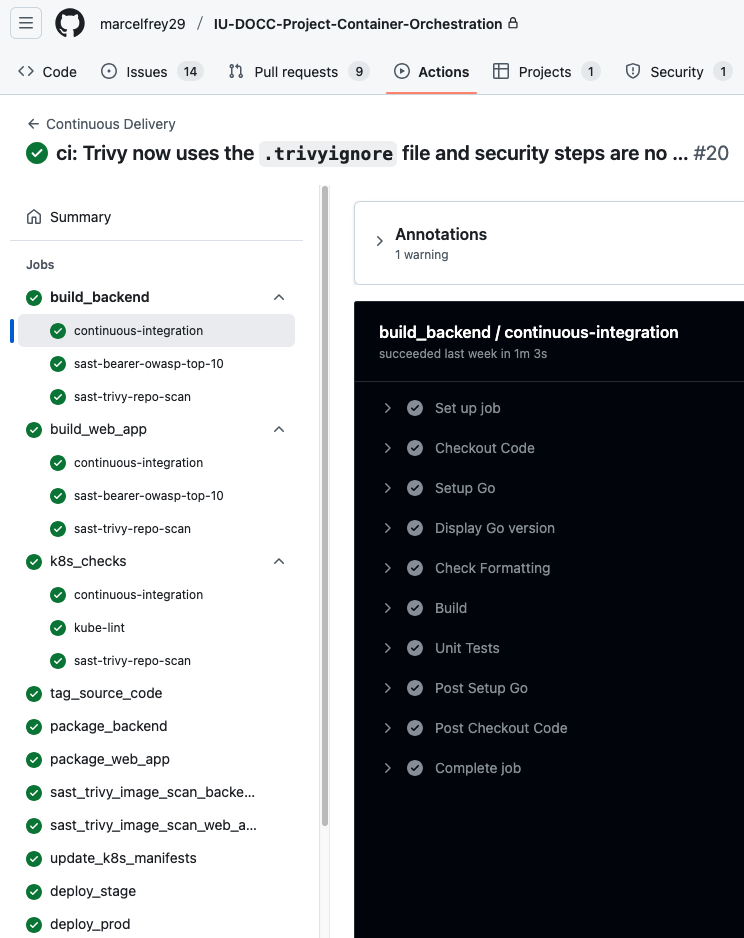
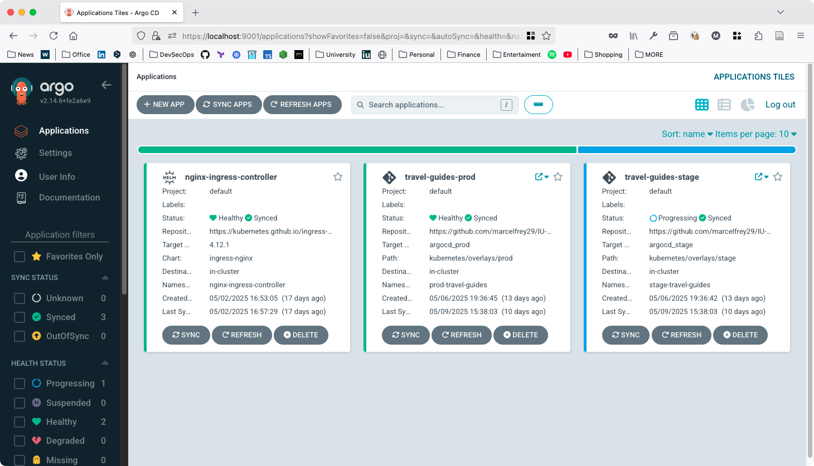
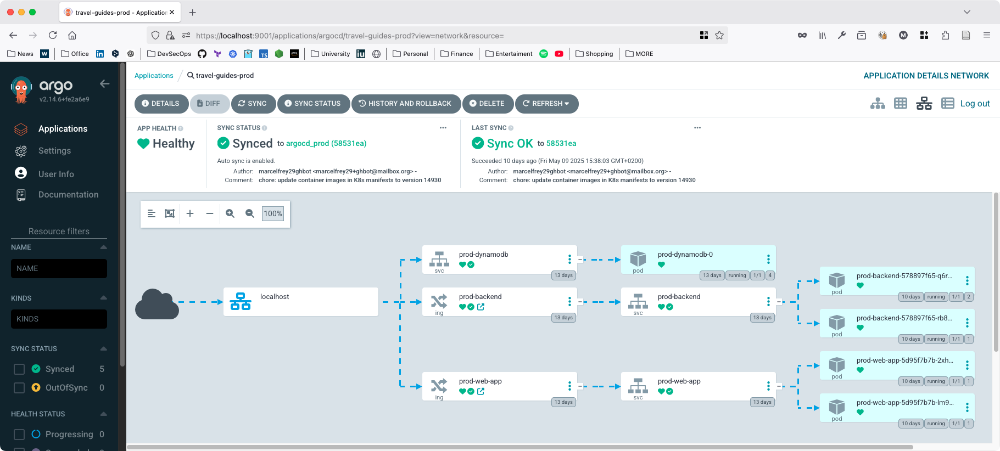
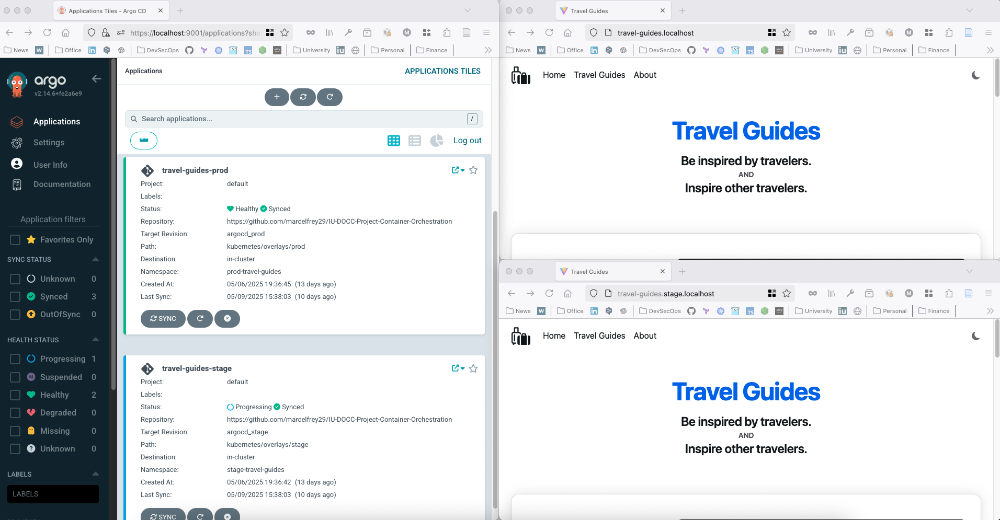
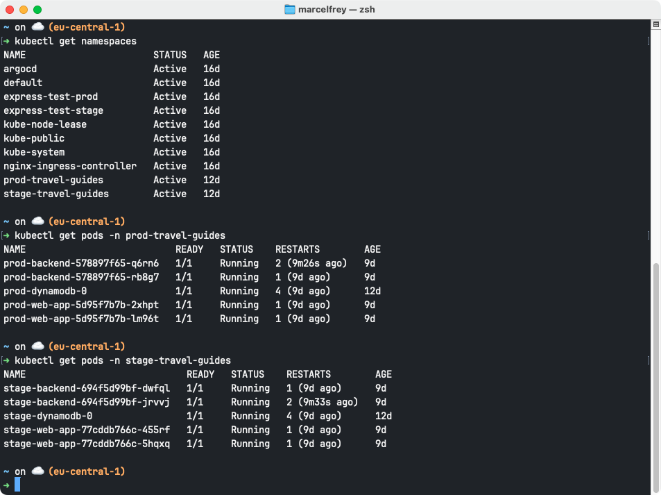

# IU-DOCC-Project-Container-Orchestration

**Continuous Deployment of a Three-Tier Web-Application to Kubernetes using GitHub Actions, Argo CD, and Kustomize**

- [x] **Continuous Integration and Delivery (CI/CD)** with **GitHub Actions** using **GitHub Container Registry (GHCR)**
- [x] **Continuous Deployment (CD)** to **Kubernetes** with **Argo CD**
- [x] **Multi-Environment Support** (`stage`-> `prod`) via **Kustomize**
- [x] **Security** is ensured by **Trivy** and **Bearer** which are part of the Pipeline and acts as quality gate
- [x] Polyglot three-tier Web Application running in **Kubernetes**
    - [x] **Horizontal Pod Autoscaling** with **HPA** für the Frontend (TypeScript/React) and Backend (Golang)
    - [x] **DynamoDB Local** database deployment as `StatefulSet`
    - [x] Access through an **nginx Ingress Controller**

## Documentation

- [Project Preparation](docs/01-Preparation.md)
- [Argo CD Installation](docs/02-Setup-Argo-CD.runme.md)
- [Access to Argo CD](docs/03-Access-Argo-CD.runme.md)

## CI/CD Architecture

**Pull-based Continuous Deployment**:

- Everything is pulled and observed from inside the cluster
- Increased security because no external access to the cluster is required
    - With a push-based approach, the cluster must be reachable from the outside and the CI/CD system needs high-privilege credentials

**Continuous Integration and Delivery with GitHub Actions**:

- Verify backend, frontend, and K8s definitions
- Build and package the backend and frontend into a container image and push it to GitHub Container Registry (GHCR)
- Run security checks 
- Update the K8s manifests with the image versions and push the changes back to the GitHub Repository
- Move the environment tags forward

**Continuous Deployment with Argo CD**:

- Argo CD observes the environment tag and maintains the desired state in the K8s cluster
- Each environment has its own namespace
- The images defined in the target-revision are pulled from GitHub Container Registry (GHCR)

**Multi-Environment support with Kustomize**:

- Prevent duplicated manifests
- Replace certain values
- Add a prefix to any resource

## Web-App Architecture

**Application components and Kubernetes resources**:

## Results

**GitHub Actions: Continuous Delivery Workflow**

**GitHub Actions: Backend Continuous Integration Steps**

**Argo CD: Overview**:

**Argo CD: Travel Guides `prod` Application**:

**Argo CD and the running `stage` and `prod` applications**:

**Kubernetes Namespaces and Pods in `stage` and `prod` Namespace**:

