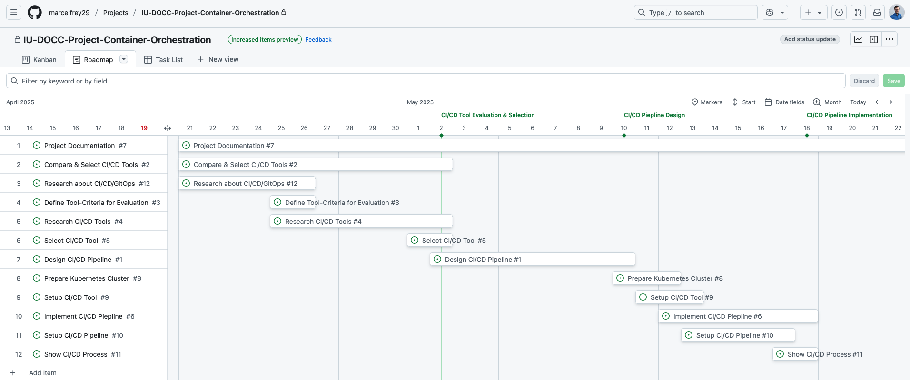
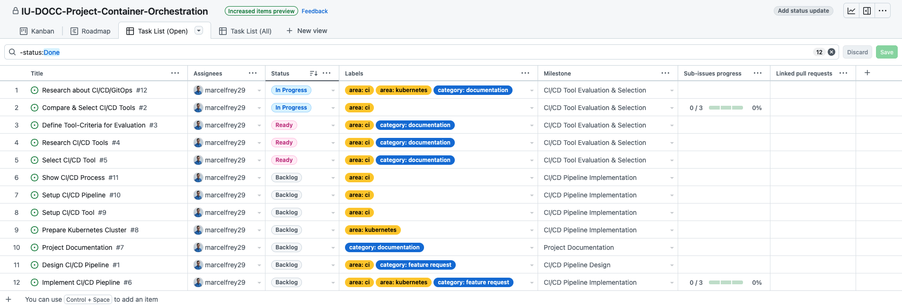

# Preparation

## Requirements & Milestones

**GitHub Issues** is used to document and track requirements, tasks, and bugs. Labels are used to categorize the issues.
While there aren't epics in GitHub, issues have been divided into smaller tasks with **sub-tasks**.

Issues are assigned to **Milestones** which have a due date in order to track project progress.
Four Milestones have been identified:

- [CI/CD Tools Evaluation & Selection](https://github.com/marcelfrey29/IU-DOCC-Project-Container-Orchestration/milestone/2): Do initial research, find and select CI/CD tools for the project
- [CI/CD Pipeline Desing](https://github.com/marcelfrey29/IU-DOCC-Project-Container-Orchestration/milestone/1): Design a Continuous Integration and Delivery Pipeline according to best practices 
- [CI/CD Pipeline Implementation](https://github.com/marcelfrey29/IU-DOCC-Project-Container-Orchestration/milestone/3): Setup a K8s Cluster, the CI/CD Tools, implement CI/CD, and show that an application can be deployed continuously
- [Project Documentation](https://github.com/marcelfrey29/IU-DOCC-Project-Container-Orchestration/milestone/4): Document the project, challenges, and learnings

For Project Management, **GitHub Project** is used. 
All issues and milestones are automatically part of the project.
The following views have been configured in order to work on the project:

- [Roadmap View](https://github.com/users/marcelfrey29/projects/1/views/3): Overview of current state and monitoring of progress
- [Kanban Board](https://github.com/users/marcelfrey29/projects/1/views/2): Quickly see which ticket is in which state
- Task Views: Quick overview of the current state of the tickets
    - [Open Tasks](https://github.com/users/marcelfrey29/projects/1/views/4)
    - [All Tasks](https://github.com/users/marcelfrey29/projects/1/views/1)

**Roadmap-View with all initial Tickets and Milestones**:

**Task List with all open Tickets in GitHub Projects**:

